# OSRS Goal Planner

A RuneLite sidebar plugin that plans and tracks your Old School RuneScape
goals — skills, quests, diaries, combat achievements, bosses, item grinds,
and account milestones. Cards **update themselves from the game** as you
play, organize into colored sections, nest into quest-guide-style outlines,
and share as paste-anywhere codes.

  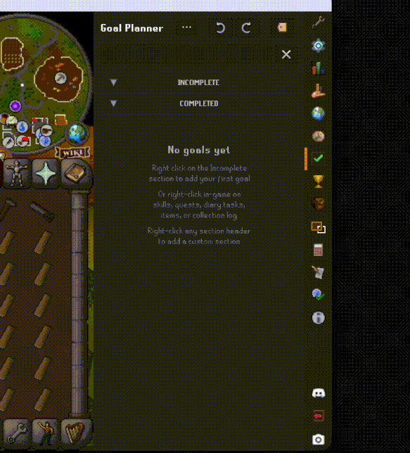

> ⚠️ **Experimental.** The save format may still change before a stable 1.0;
> if you upgrade across a breaking change you may need to re-create goals.
> See [CHANGELOG.md](CHANGELOG.md) for what's in the current release.

## Install

Open RuneLite → **Configuration** (wrench) → **Plugin Hub** → search
**Goal Planner** → *Install*. The plugin adds a target icon to your sidebar.

Building from source? See **[docs/DEVELOPMENT.md](docs/DEVELOPMENT.md)**.

## Goal types

| Type | Auto-tracked | Notes |
|------|--------------|-------|
| **Skill** | ✓ XP | Target by level (1–99) or raw XP up to 200M. Same-skill goals auto-order lowest-target first. |
| **Quest** | ✓ | Done when the quest is complete. Adding one can seed its whole prerequisite chain. |
| **Achievement Diary** | ✓ | One goal per area + tier, all areas with verified requirements. |
| **Combat Achievement** | ✓ | All 640 task slots, with tier-sword icons. |
| **Boss Kill Count** | ✓ | 89 bosses/activities — GWD, slayer, wilderness, DT2, raids, Colosseum, and more. Groups like "GWD" fan out into one goal per boss. |
| **Item / Resource Grind** | ✓ | Counts inventory + bank. Sets and loadouts ("full masori + tbow") fan out into a goal per piece. |
| **Account Metric** | ✓ | Quest Points, Combat/Total Level, CA & Slayer Points, Kudos, Collection Log Slots, Diary Tiers, Tears of Guthix PB, and more. Leagues metrics appear only on leagues profiles. |
| **Custom** | manual | Free-text checklist items with their own name, color, and tags. |

---

# Feature guide

**Creating goals:** [Panel dialog](#add-a-goal-from-the-panel) · [In-game right-click](#add-goals-from-the-game) · [Requirement seeding](#automatic-requirement-trees) · [Add requirements later](#add-requirements-to-an-existing-goal)
**Tracking:** [Auto-tracking](#auto-tracking) · [Account metrics](#account-metrics) · [Change Amount](#change-amount--retargeting) · [Manual completion](#manual-completion)
**Organizing:** [Sections](#sections) · [Completed-goal handling](#completed-goal-handling) · [Move & duplicate](#move--duplicate-across-sections) · [Dependency nesting](#dependency-nesting-guide-view) · [Tags](#tags) · [Colors](#colors) · [Search](#search)
**Selection & safety:** [Multi-select](#multi-select--section-select-all) · [Bulk actions](#bulk-actions) · [Undo / redo](#undo--redo)
**Sharing:** [Share codes](#share-codes) · [Importing](#importing) · [Saved plans](#saved-plans) · [Cross-section dependencies](#cross-section-dependencies) · [Crafting codes with AI](#crafting-codes-with-ai)

## Creating goals

### Add a goal from the panel

Right-click any section header → **Add Goal** → *At Top/Bottom of Section* (or right-click an existing card for *Above/Below This Goal*). Pick a type — Skill, Quest, Diary, Combat Achievement, Boss, Item, Account, or Custom — fill the target, done. Typed goals start tracking immediately.

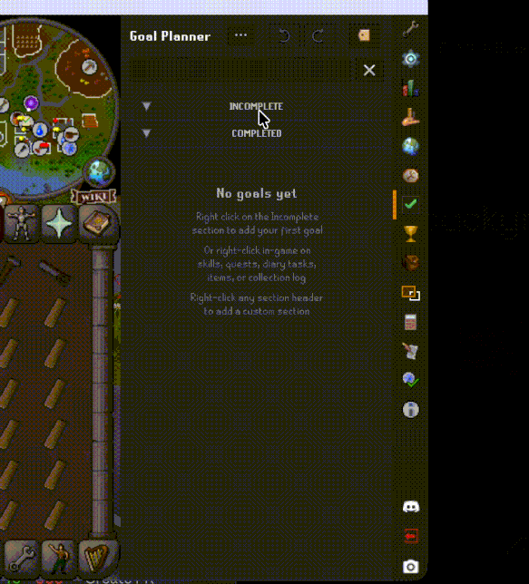

### Add goals from the game

Right-click where you already are: a skill in the **Stats tab**, a quest in the **Quest list**, an **Achievement Diary** area (one entry per tier: *Add Goal Easy ▸ … Elite ▸*), a boss or item in the **Collection log**, an item in your **inventory/bank**, or a **CA task** — every menu drills straight into your sections, so the goal lands where it belongs in one gesture.

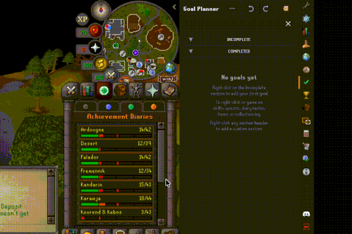

### Automatic requirement trees

Adding a quest or boss goal seeds its full prerequisite tree — skills, prior quests, items, account metrics, boss-kill prereqs, and OR-alternatives — AND-linked into the same section. Shared prerequisites are created once and reused. Already-met requirements are skipped, checked against your live account.

> 🎥 *Clip coming soon.*

### Add requirements to an existing goal

Already have the goal? Right-click it → **Add requirements to this section** → *Incomplete only* (just what you still need) or *All* (the whole tree, met requirements kept inline as ✓ cards). Works for quests, diaries, and **bosses** (e.g. an Abyssal Sire goal seeds its 85 Slayer + Enter the Abyss requirements).

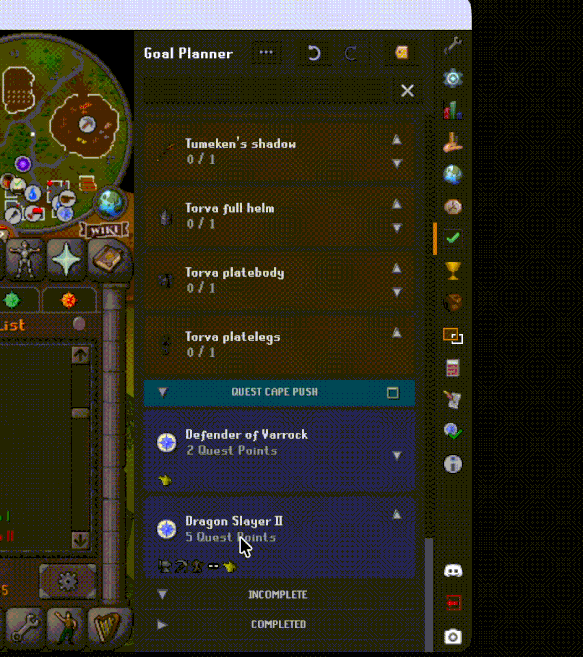

### Blocked-by-prerequisites badge

When a quest, diary, or boss goal has a direct prerequisite you **haven't met** and that **isn't already in your plan**, the card shows a small ⚠ badge. Hover it to see exactly what's likely blocking you (e.g. *85 Slayer*, *Enter the Abyss*); **click it** to add those missing requirements to the section in one go. It uses the plugin's requirement data + your live account, so it surfaces blockers you might not have known were in the way — and a requirement you're already working toward (a higher-level skill goal) doesn't trip it.

> 🎥 *Clip coming soon.*

## Tracking

### Auto-tracking

Cards update from game state on their own: skills by XP, quests by completion state, diaries by varbit, CA tasks bit-by-bit, bosses by kill count, items by inventory + bank count, account metrics by their varps. No check-offs — play the game and the bars move.

> 🎥 *Clip coming soon.*

### Account metrics

Sixteen account-wide metrics — Quest Points, Total/Combat Level, CA Points, Slayer Points, Kudos, Collection Log Slots, Diary Tiers, Tears of Guthix PB, and more. The Collection Log ceiling is read **live from the client** (it grows as slots are added); Quest Points / ToG PB use a wiki-authoritative max (335). Targets *above* the max are allowed — they keep tracking until the game catches up. League metrics only appear on leagues profiles.

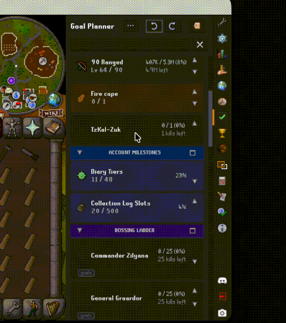

### Change Amount / retargeting

Right-click a skill or item goal → **Change Amount**. Works on *completed* goals too: raise the target past your recorded progress and the goal reopens with tracking resumed; lower an active goal's target to something you've already met and it completes on the spot. Undo restores everything, original completion date included.

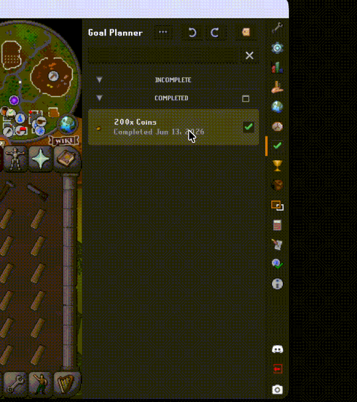

### Manual completion

Custom and item goals can be marked complete or incomplete by hand from the right-click menu — for the "I'll call that done" moments auto-tracking can't see.

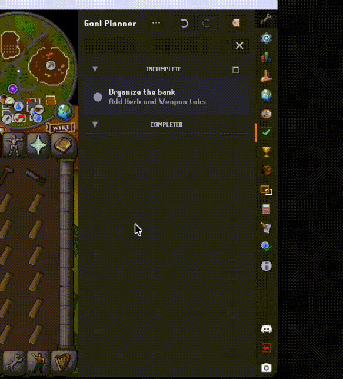

## Organizing

### Sections

Sections are independent buckets with their own name, color, and goals. Create them from any header's right-click (*Add Section*), rename, recolor, reorder, or delete (a confirm offers to relocate the goals instead). Built-in **Incomplete** and **Completed** hold everything that isn't in a section of yours.

### Completed-goal handling

By default a completed goal graduates to the **Completed** list. Flip a section to *keep inline* (header right-click → **Completed goals**) and finished goals stay as ✓ cards at the bottom instead — a checklist that remembers what you've done. Global default + per-section override.

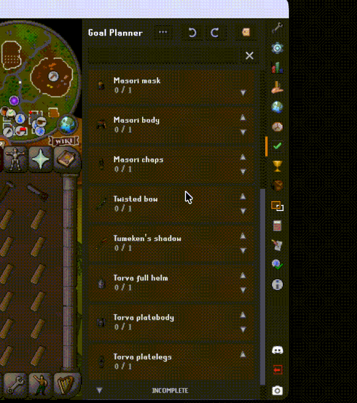

### Move & duplicate across sections

Right-click a goal (or selection) → **Move to Section** or **Duplicate to Section**. Identity is per-section: the same goal can live once in *each* plan, and duplicates are independent copies (relations within a duplicated selection are preserved).

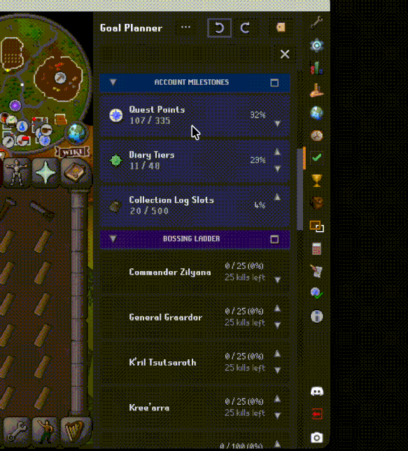

### Dependency nesting (guide view)

Turn a section into an outline: each goal indents under the prerequisite it unlocks, with a thin file-tree guide — your plan reads top-to-bottom like a quest guide. Per section: header right-click → **Dependency nesting** → *Nested / Not nested* (or set the global default in config). Completed steps stay visible in place.

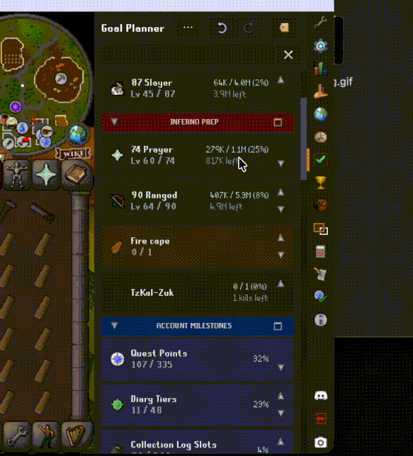

### Tags

Goals carry colored tags (Slayer, Quest, F2P, boss names…) — seeded automatically for known content, manageable from the panel's tag button: recolor, rename, hide, or icon any tag, and bulk-apply via multi-select.

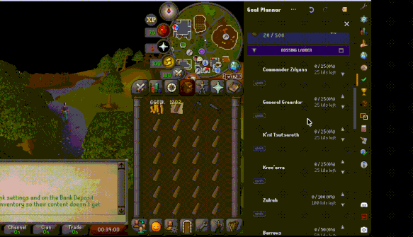

### Colors

Every section, goal, and tag takes a color override — curated 12-swatch palette with a full picker behind it. Section headers darken your pick automatically so the text stays readable.

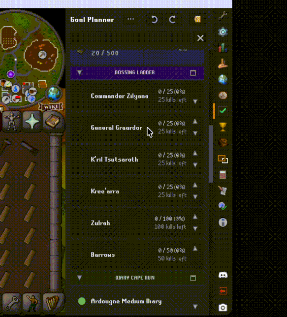

### Search

The search box filters live across name, description, tag, category, type, and section — empty sections hide while a filter is active.

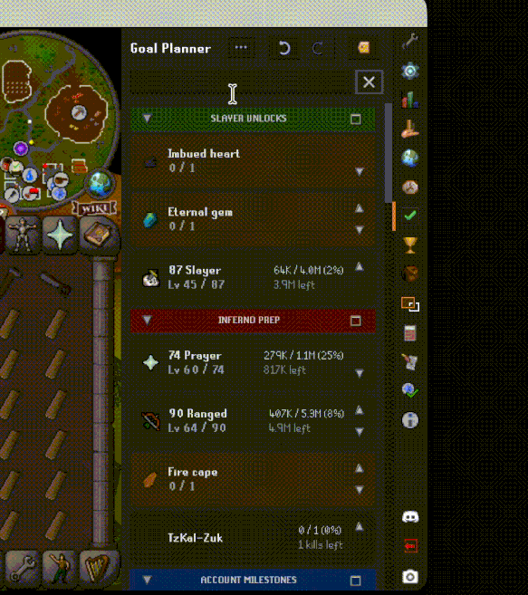

## Selection & safety

### Multi-select + section select-all

Click to select, **⌘/Ctrl-click** to add, **Shift-click** for ranges — or hit the checkbox on a section header to select/unselect the whole section at once (it ticks when everything's in).

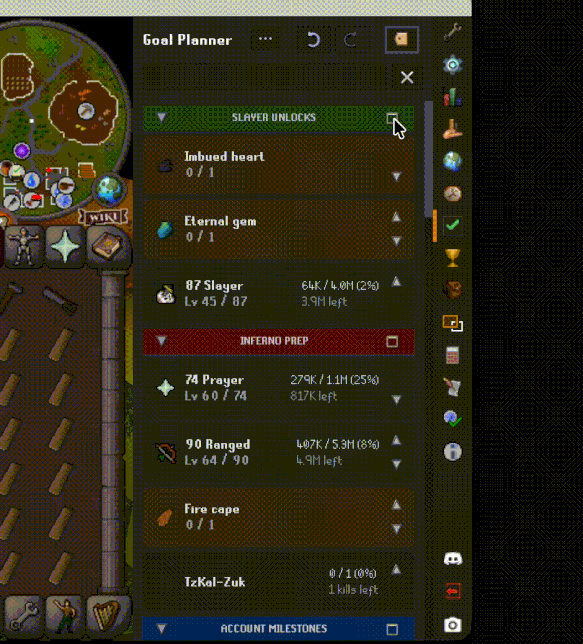

### Bulk actions

Right-click any multi-selection: Move/Duplicate to Section, Add/Remove Tag, Change Color, Mark Complete, Remove — one gesture, the whole selection, one undo.

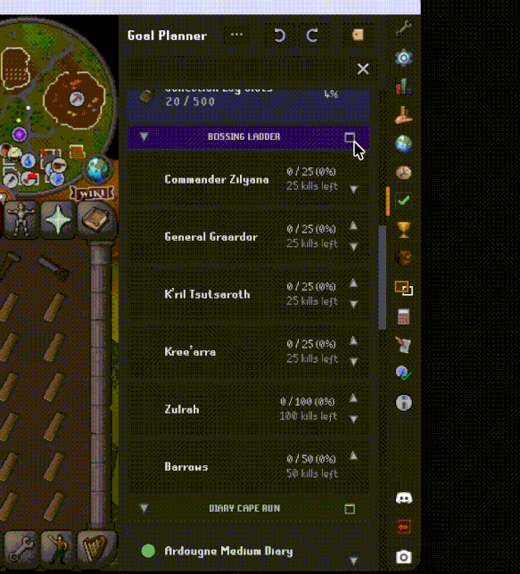

### Undo / redo

**⌘Z / ⌘⇧Z** (Ctrl on Windows) reverses *every* mutation — adds, removes, retargets, moves, imports, bulk actions, section deletes. The ↺ ↻ buttons at the panel top show what's next in the stack on hover.

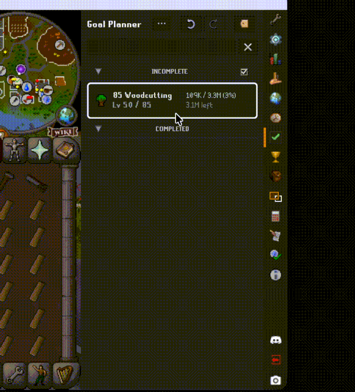

## Sharing

### Share codes

Right-click a section header (or a multi-selection) → **Share** → *Copy share code*. You get a compact `GPSHARE…` string that carries the goal *definitions* — types, targets, colors, tags, relations — never your progress. Paste it anywhere: Discord, clan chat, a wiki page.

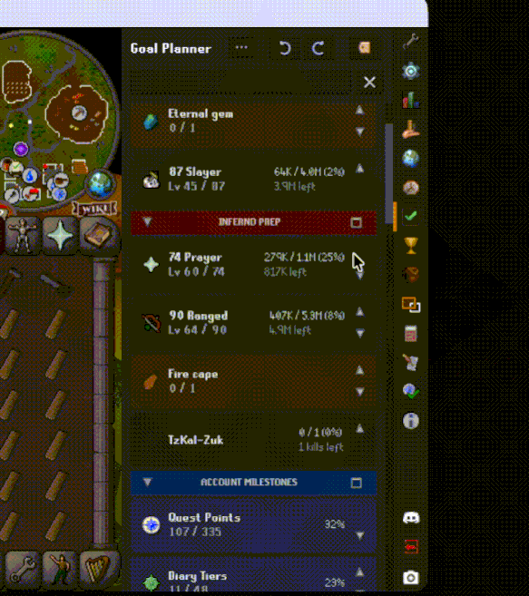

### Importing

Panel **⋯ → Import shared goals…**, paste, done: sections arrive with their names and colors, goals start tracking against *your* account immediately, and one **⌘Z** reverses the entire import. Re-importing a default-target code never duplicates — existing equivalent goals are reused.

### Saved plans

Not ready to import a code yet? Bank it. **Save share code…** sits next to *Copy share code* on any Share menu, and the import dialog offers **Save for later** — both drop the code into your **Saved Plans** library (panel **⋯ → Saved plans…**) instead of adding goals now. Each saved plan keeps a name you choose and a decoded preview (*"12 goals · 3 sections"*); from the library you can **import**, **copy the code**, **rename** it, **edit how each section will be named on import**, or delete it. The library is global — the same saved plans show on every profile, including leagues.

> 🎥 *Clip coming soon.*

### Cross-section dependencies

Multi-section codes carry dependency links *between* sections — "TzKal-Zuk needs the Imbued heart from your Slayer plan" survives the trip and rewires on import, so a shared multi-plan keeps its structure.

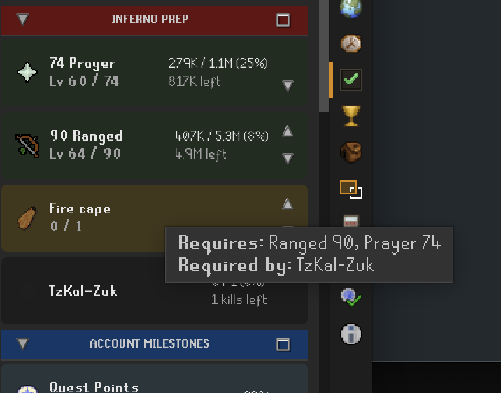

### Crafting codes with AI

The [goalplanner-share-mcp](https://github.com/ajkatz/goalplanner-share-mcp) server lets an AI assistant build import codes from plain English — *"make me an Inferno prep plan with the slayer unlocks I need"* → a previewed, validated share code with every goal auto-tracking. Every code in this guide was generated by it.

---

## Also worth knowing

- **Local & private** — every goal, section, color, and tag is saved on your own client and survives restarts. Leagues worlds get an isolated profile, so seasonal progress never touches your main plans.
- **Readable fonts** — pick a panel font family and size scale under the *Appearance* config section; it applies live.
- **Plays well with other plugins** — Goal Planner exposes a public Java API and a cross-plugin import message, so other RuneLite plugins can read your goals or hand you a plan to import. See [docs/DEVELOPMENT.md](docs/DEVELOPMENT.md).

## For developers

Building from source, the architecture, the public API, and how the docs
stay in sync all live under **[docs/DEVELOPMENT.md](docs/DEVELOPMENT.md)** —
plus [API.md](API.md), [ARCHITECTURE.md](ARCHITECTURE.md),
[CONTRIBUTING.md](CONTRIBUTING.md), and [CHANGELOG.md](CHANGELOG.md).

## License

BSD 2-Clause. See [LICENSE](LICENSE).
