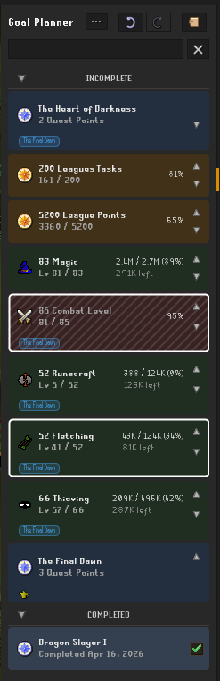

# OSRS Goal Planner — RuneLite Plugin

[](https://discord.gg/CFQsA3fmh7)
[](LICENSE)
[](https://github.com/ajkatz/runelite-goal-planner/releases)

> ⚠️ **Experimental v0.1.0** — This is the first public cut. Persistence
> format and the public Java API may change in breaking ways before a
> stable 1.0 tag. If you track goals with this today, expect to
> re-create them if you upgrade across a breaking change. See
> [CHANGELOG.md](CHANGELOG.md) for what's in this release.

A RuneLite sidebar plugin that tracks Old School RuneScape goals and
grinds. Cards auto-update from game state, support sections + colors +
tags + multi-select bulk actions + undo/redo, and expose a public Java
API so other plugins can read and create goals programmatically.

<p align="center">
  
</p>

## Goal types

| Type                    | Auto-tracked | Notes |
|-------------------------|--------------|-------|
| **Skill**               | Yes (XP)     | Target by Level (1–99) or raw XP up to 200M. Same-skill goals auto-order lower-target above higher-target within their section. |
| **Quest**               | Yes          | Binary: complete when `Quest.getState(client) == FINISHED`. Adding a quest can seed its full prereq chain (skills, prior quests, recommended combat). |
| **Achievement Diary**   | Yes (varbits) | One goal per (area, tier). All 11 areas with verified requirements. Karamja Easy/Med/Hard lack named varbits and stay manual. |
| **Combat Achievement**  | Yes (varplayers) | Bit-packed across 20 `CA_TASK_COMPLETED` varplayers. 640 task slots covered. Wiki data + tier sword icons. |
| **Boss Kill Count**     | Yes (varps)  | 89 bosses/activities incl. GWD, slayer, wilderness, DT2 (+ awakened), raids, Perilous Moons, Fortis Colosseum, Doom of Mokhaiotl (per-level), Brutus, Gauntlet, Barrows, etc. Prereqs auto-seed with transitive quest chaining. |
| **Item / Resource Grind** | Yes        | Counts inventory + bank. Manually markable when you want to call it done. |
| **Account Metric**      | Yes          | Quest Points, Combat Level, Total Level, CA Points, Slayer Points, Museum Kudos, Combined Att+Str, Misc Approval, Tears of Guthix PB, Chompy Kills, Colosseum Glory, DoM Deepest Level, League Points, League Tasks. |
| **Custom**              | Manual       | Free-text. User-set name, description, color, tags. |

## Features

- **Sections** — built-in Incomplete + Completed plus user-defined sections in the middle band. Each section can be renamed, recolored, reordered, and right-clicked for bulk operations.
- **Colors** — every section, goal, and tag has a default color and an optional user override. Curated 12-swatch palette + JColorChooser escape hatch. Section header backgrounds are darkened to keep light text readable.
- **Multi-select + bulk actions** — click to select, cmd/ctrl-click to multi-select. Right-click a multi-selection for bulk Move to Section, Add Tag, Change Color, Mark Complete (CUSTOM only), Remove. Selection state is ephemeral.
- **Undo / Redo** — Ctrl-Z / Ctrl-Shift-Z (or Cmd on macOS) reverses every user mutation: adds, removes, edits, reorders, bulk actions, section changes, color + tag edits.
- **Right-click menus** — goal/section context menus built lazily on each show. Tags can be recolored, moved, hidden; goals can be marked complete/incomplete, removed, moved to sections; sections restore their default tags.
- **In-game integration** — right-click any skill in the Stats tab → Add Goal → enter Level/XP. Right-click any quest, diary row, CA task, boss/activity entry in the collection log, or inventory/bank/CA item → Add Goal as well.
- **Prereq seeding** — adding a quest/diary/boss goal that has its own requirements offers "Add Goal with Requirements" which recursively seeds the whole AND-linked prereq tree (skills, child quests, item requirements, account metrics, boss-kill prereqs, and OR-alternatives where defined).
- **Public API** — other RuneLite plugins can declare `@PluginDependency(GoalPlannerPlugin.class)` and inject `GoalPlannerApi` to read goals + sections + tags and create new ones. See [API.md](API.md).
- **Local persistence** — every goal, section, color, and tag round-trips through `ConfigManager`. Survives client restarts. Schema migrations for built-in section ordering and boss-goal section reconciliation.

## Install (development)

```bash
export JAVA_HOME=/path/to/jdk-21
./gradlew run
```

Requires JDK 21 (Zulu recommended on macOS for FlatLaf compatibility).
The `run` task launches RuneLite in developer mode with the plugin
loaded. Public plugin-hub install flow will follow in a future release.

## Architecture

See [ARCHITECTURE.md](ARCHITECTURE.md) for the full module + data flow
walkthrough.

Quick map:

```
src/main/java/com/goalplanner/
├── GoalPlannerPlugin.java        # Plugin lifecycle, event handlers, MenuEntry injection
├── GoalPlannerConfig.java        # RuneLite plugin settings
├── api/                          # Public + internal API impl (GoalPlannerApi, DTOs, services)
├── command/                      # Undo/redo command pattern (Command, CompositeCommand, CommandHistory)
├── data/                         # Quest / diary / CA / boss requirement tables + resolvers
├── model/                        # Persisted entities (Goal, Section, ItemTag, enums)
├── persistence/
│   └── GoalStore.java            # ConfigManager-backed JSON + migrations + reconcile
├── service/
│   └── GoalReorderingService.java  # Skill-chain + section-aware ordering rules
├── tracker/                      # 8 trackers: Skill / Quest / Diary / CA / Item / Boss / Account / base
├── ui/                           # 14 Swing components: panel, cards, dialogs, pickers, icons
└── util/                         # Formatting helpers
```

## Testing

```bash
./gradlew test
```

399 tests covering the API impl, persistence + migrations, all 8
trackers, the reordering service, requirement resolvers, OR-group
seeding, and integration flows that cover deep prereq chains. New code
that adds public API methods ships with tests in the same change. See
[TESTING.md](TESTING.md) for the fixture pattern, mock-vs-fake rules,
and the MockClient thread-affinity caveat.

## Documentation

- [CHANGELOG.md](CHANGELOG.md) — release notes
- [API.md](API.md) — public API reference for external plugin consumers
- [ARCHITECTURE.md](ARCHITECTURE.md) — module map, data flow, key invariants
- [ROADMAP.md](ROADMAP.md) — planned future work
- [CONTRIBUTING.md](CONTRIBUTING.md) — commit style, test-first rule, known pitfalls
- [TESTING.md](TESTING.md) — test fixtures, mock-vs-fake rules

## License

BSD 2-Clause. See [LICENSE](LICENSE).
